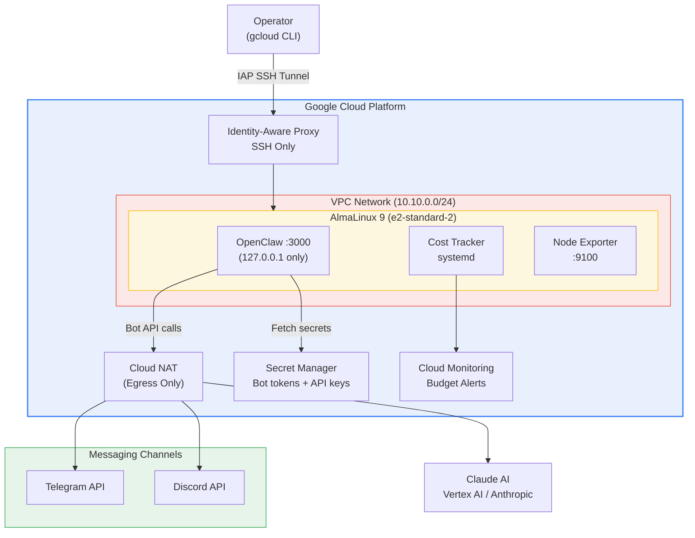

# OpenClaw GCP Deployment -- Production-Grade AI Assistant Infrastructure

[](https://www.terraform.io/)
[](https://www.ansible.com/)
[](https://cloud.google.com/)
[](https://almalinux.org/)
[](LICENSE)

Fully automated, security-first deployment of [OpenClaw](https://openclaw.ai) personal AI assistant on Google Cloud Platform.

In my 12 years managing enterprise infrastructure across the UAE and Egypt, I have seen too many AI deployments treated as afterthoughts -- containers thrown onto a VM with no hardening, secrets in environment variables, and zero cost visibility. This project is how I deploy AI assistants for production: security-first, cost-aware, and fully automated.

No domain name required. OpenClaw communicates outbound to Telegram, Discord, and WhatsApp APIs. The VM is unreachable from the internet.

---

## Architecture



---

## Features

- **Outbound-only bot architecture** -- No inbound ports open; the VM is completely unreachable from the internet; no domain or SSL certificate required
- **Telegram and Discord integration** -- Bot tokens fetched from Secret Manager at deploy time; long polling means zero webhook infrastructure
- **Security-first** -- SELinux enforcing, firewalld with default-drop zone (SSH only), CIS-aligned sysctl hardening, Shielded VM with Secure Boot
- **Zero secrets in code** -- GCP Secret Manager with runtime fetching; API keys and bot tokens never touch disk or version control
- **Dual Claude AI provider support** -- Toggle between Anthropic direct API and Vertex AI with a single variable
- **No public IP** -- Instance has no external IP; egress via Cloud NAT; SSH via Identity-Aware Proxy only
- **Claude API cost monitoring** -- Python systemd service pushes token usage to Cloud Monitoring with budget alerts
- **AlmaLinux 9** -- Red Hat ecosystem, binary-compatible with RHEL, enterprise-grade without the license cost
- **Fully automated** -- Single `deploy.sh` runs Terraform + Ansible end to end

---

## Project Structure

```
openclaw-gcp/
|-- README.md
|-- LICENSE
|-- scripts/
|   |-- setup-tf-backend.sh   # One-time: creates GCS bucket for remote state
|   `-- deploy.sh              # Single command: Terraform + Ansible end to end
|-- terraform/
|   |-- versions.tf            # Provider versions and constraints
|   |-- backend.tf             # GCS remote state (optional)
|   |-- variables.tf           # Input variables with validation
|   |-- main.tf                # Locals, data sources
|   |-- network.tf             # VPC, subnet, Cloud NAT, firewall rules
|   |-- compute.tf             # GCE instance (no public IP)
|   |-- iam.tf                 # Service account, IAM bindings
|   |-- secrets.tf             # Secret Manager resources (API keys + bot tokens)
|   |-- monitoring.tf          # Budget alerts, notification channels
|   |-- outputs.tf             # Key outputs (instance name, IAP commands, secret IDs)
|   `-- terraform.tfvars.example
|-- ansible/
|   |-- ansible.cfg
|   |-- site.yml
|   |-- inventory/
|   |   `-- gcp.yml            # Dynamic GCP inventory
|   |-- group_vars/
|   |   `-- all.yml            # Channel config, provider, monitoring
|   `-- roles/
|       |-- base-hardening/    # SELinux, firewalld (SSH only), SSH, sysctl, CIS
|       |-- docker/            # Docker CE, Compose, SELinux integration
|       |-- secrets/           # GCP Secret Manager fetch (API keys + bot tokens)
|       |-- openclaw/          # OpenClaw container deployment
|       `-- monitoring/        # Cost tracker, node exporter
`-- docs/
    |-- architecture.md
    |-- security.md
    `-- cost-monitoring.md
```

---

## Prerequisites

| Tool | Version | Purpose |
|------|---------|---------|
| Terraform | >= 1.5 | Infrastructure provisioning |
| Ansible | >= 2.15 | Configuration management |
| gcloud CLI | Latest | GCP authentication and project setup |
| GCP Project | -- | With billing enabled |

Enable the required GCP APIs:

```bash
gcloud services enable \
  compute.googleapis.com \
  secretmanager.googleapis.com \
  iap.googleapis.com \
  monitoring.googleapis.com \
  billingbudgets.googleapis.com
```

---

## Quick Start

**1. Clone the repository**

```bash
git clone https://github.com/maziz00/openclaw-gcp.git
cd openclaw-gcp
```

**2. Configure your deployment**

```bash
cp terraform/terraform.tfvars.example terraform/terraform.tfvars
```

Edit `terraform/terraform.tfvars` with your values:

```hcl
project_id         = "my-gcp-project"
zone               = "us-central1-a"
notification_email = "alerts@example.com"
claude_provider    = "anthropic_api"   # or "vertex_ai"
budget_amount      = 100
```

**3. Set up Terraform remote state (one-time)**

```bash
chmod +x scripts/setup-tf-backend.sh
cd scripts && ./setup-tf-backend.sh
```

This creates a GCS bucket (`<project-id>-openclaw-tfstate`) with versioning and uniform access. The bucket name is already configured in `terraform/backend.tf`.

**4. Deploy**

```bash
chmod +x scripts/deploy.sh
./scripts/deploy.sh
```

The script runs Terraform to provision infrastructure, waits for the instance, then runs Ansible to configure the application. Total deployment takes roughly 8-12 minutes.

**5. Populate bot tokens**

After `terraform apply`, add your bot tokens to Secret Manager:

```bash
# Telegram bot token (from @BotFather)
echo -n "YOUR_TELEGRAM_BOT_TOKEN" | \
  gcloud secrets versions add openclaw-production-telegram-bot-token --data-file=-

# Discord bot token (from Discord Developer Portal)
echo -n "YOUR_DISCORD_BOT_TOKEN" | \
  gcloud secrets versions add openclaw-production-discord-bot-token --data-file=-
```

Then run Ansible to pick up the new tokens:

```bash
cd ansible && ansible-playbook site.yml -e "gcp_project_id=my-gcp-project"
```

---

## Accessing the UI

To access the OpenClaw web UI in your browser without a domain or public IP:

```bash
gcloud compute ssh openclaw-production-instance \
  --zone us-central1-a \
  --tunnel-through-iap \
  -- -L 3000:localhost:3000
```

Then open `http://localhost:3000`. The SSH port-forward keeps the session open; close the terminal to end it. This is for admin and configuration purposes -- end users interact with OpenClaw through Telegram or Discord.

---

## Configuration

### Key Terraform Variables

| Variable | Default | Description |
|----------|---------|-------------|
| `project_id` | -- (required) | GCP project ID |
| `region` | `us-central1` | GCP region |
| `zone` | -- (required) | GCP zone within region |
| `instance_type` | `e2-standard-2` | GCE machine type (2 vCPU, 8 GB) |
| `claude_provider` | `anthropic_api` | `anthropic_api` or `vertex_ai` |
| `environment` | `production` | Environment label (production/staging/development) |
| `budget_amount` | `100` | Monthly budget alert threshold in USD |
| `notification_email` | -- (required) | Email for budget and monitoring alerts |
| `ssh_source_ranges` | `[]` | CIDR ranges for direct SSH (prefer IAP instead) |

### Key Ansible Variables

| Variable | Default | Description |
|----------|---------|-------------|
| `claude_provider` | `anthropic_api` | Must match Terraform setting |
| `openclaw_version` | `latest` | OpenClaw Docker image tag |
| `openclaw_port` | `3000` | Application listen port (localhost only) |
| `openclaw_channels.telegram` | `true` | Enable Telegram bot (requires secret) |
| `openclaw_channels.discord` | `true` | Enable Discord bot (requires secret) |
| `cost_tracker_interval` | `300` | Seconds between cost metric pushes |

---

## Security

This deployment follows a defense-in-depth approach:

- **SELinux enforcing** with targeted policy and Docker container management
- **firewalld** with default-drop zone -- SSH only (no HTTP/HTTPS; there is nothing to serve)
- **SSH hardened** -- no root login, no password auth, max 3 attempts
- **No public IP** on the instance -- egress via Cloud NAT, SSH via IAP tunnel
- **Shielded VM** -- Secure Boot, vTPM, and integrity monitoring enabled
- **GCP Secret Manager** -- API keys and bot tokens fetched at runtime, never stored on disk
- **CIS-aligned sysctl** -- ICMP broadcast ignore, SYN cookies, martian logging, ASLR

For the full security documentation, see [docs/security.md](docs/security.md).

---

## Cost Monitoring

A Python systemd service tracks Claude API token usage and pushes custom metrics to Cloud Monitoring. Budget alerts notify you before costs exceed your threshold.

- Custom metric: `custom.googleapis.com/openclaw/claude_api_cost`
- Default budget threshold: $100/month (configurable via `budget_amount`)
- Alert channels: email (expandable to Slack, PagerDuty)

For setup details and dashboard configuration, see [docs/cost-monitoring.md](docs/cost-monitoring.md).

---

## Why OpenClaw

[OpenClaw](https://openclaw.ai) is an open-source AI assistant that gives you full control over your AI interactions. Unlike hosted solutions, you own your data, control your costs, and can switch between AI providers without vendor lock-in. This deployment brings OpenClaw to production with the same infrastructure standards I apply to enterprise workloads in the MENA region.

---

## Documentation

- [Architecture](docs/architecture.md) -- Network topology, compute, messaging channels, secrets flow
- [Security](docs/security.md) -- SELinux, firewalld, SSH, CIS alignment, Docker hardening
- [Cost Monitoring](docs/cost-monitoring.md) -- Claude API tracking, budget alerts, dashboards

---

## Author

**Mohamed AbdelAziz** -- Senior DevOps Architect
12 years career tech journey, Servers, Kubernetes, GCP, AWS and AI Infrastructure

- [LinkedIn](https://www.linkedin.com/in/maziz00/) | [Medium](https://medium.com/@maziz00) | [Upwork](https://www.upwork.com/freelancers/maziz00?s=1110580753140797440) | [Consulting](https://calendly.com/maziz00/devops)

---

## License

This project is licensed under the MIT License. See [LICENSE](LICENSE) for details.
