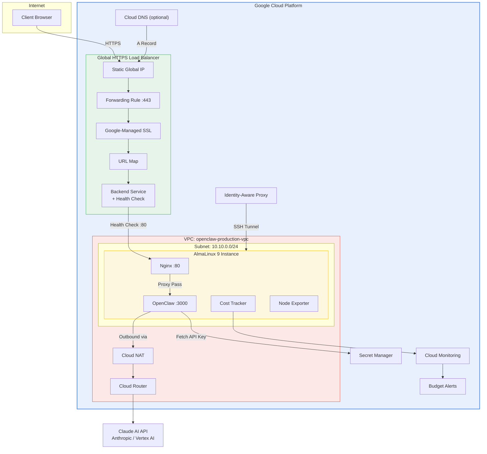
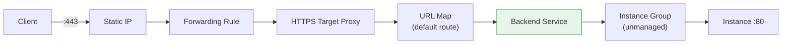
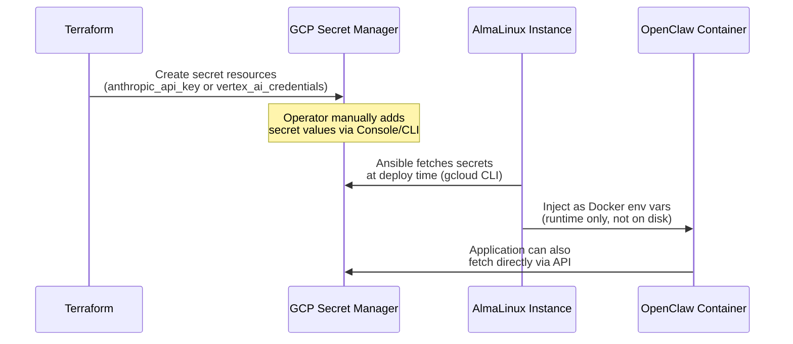
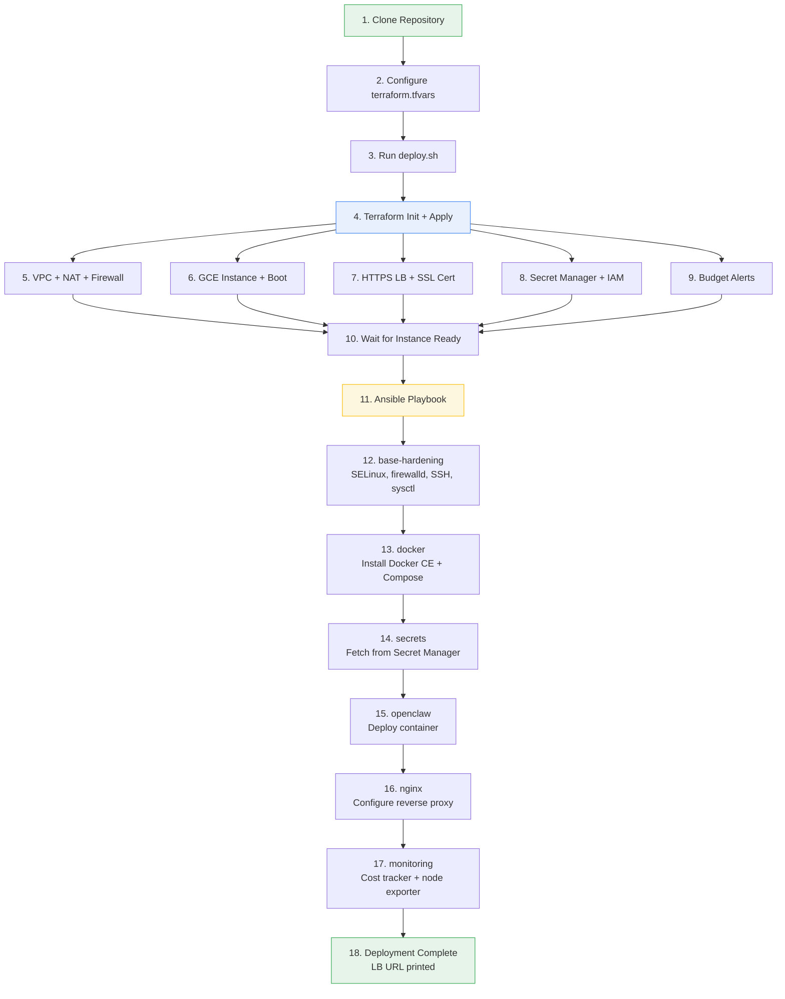

# Architecture

This document describes the full infrastructure architecture for the OpenClaw GCP deployment. Every design decision here comes from running production workloads across enterprise environments in the MENA region -- where compliance requirements, cost sensitivity, and operational simplicity are non-negotiable.

---

## High-Level Overview

---

## Network Architecture

### VPC Design

The deployment uses a custom-mode VPC with a single subnet. Custom mode prevents GCP from auto-creating subnets in every region, which keeps the network clean and auditable.

| Resource | Name | Details |
|----------|------|---------|
| VPC | `openclaw-production-vpc` | Custom mode, no auto-subnets |
| Subnet | `openclaw-production-subnet` | `10.10.0.0/24`, Private Google Access enabled |
| Cloud Router | `openclaw-production-router` | BGP ASN 64514 |
| Cloud NAT | `openclaw-production-nat` | Auto-allocated IPs, all subnets |

**Private Google Access** is enabled on the subnet, which means the instance can reach Google APIs (Secret Manager, Cloud Storage, Monitoring) without routing through Cloud NAT. This reduces NAT costs and latency for GCP API calls.

### No Public IP

The instance has no public IP address. This is a deliberate security decision:

- **Inbound traffic** reaches the instance only through the HTTPS Load Balancer (health check probes from Google's dedicated ranges `130.211.0.0/22` and `35.191.0.0/16`)
- **SSH access** goes through Identity-Aware Proxy (IAP), which proxies TCP connections through `35.235.240.0/20` -- no SSH port exposed to the internet
- **Outbound traffic** (pulling container images, calling Claude API) routes through Cloud NAT

### Firewall Rules

Firewall rules follow a default-deny model:

| Rule | Priority | Source | Ports | Purpose |
|------|----------|--------|-------|---------|
| `allow-health-check` | 1000 | GCP health check ranges | TCP 80 | LB health probes |
| `allow-iap` | 1000 | `35.235.240.0/20` | TCP 22 | SSH via IAP tunnel |
| `allow-ssh` (optional) | 1000 | User-defined CIDRs | TCP 22 | Direct SSH (disabled by default) |
| `deny-all-ingress` | 65534 | `0.0.0.0/0` | All | Explicit default deny |

VPC flow logs are enabled on the subnet with 50% sampling and 10-minute aggregation for network forensics.

---

## Compute

### Why AlmaLinux 9

I chose AlmaLinux 9 over Ubuntu for several reasons:

1. **SELinux works out of the box** -- Ubuntu uses AppArmor, which lacks the granular mandatory access control needed for container workloads in regulated environments
2. **Red Hat ecosystem** -- Binary-compatible with RHEL 9, which means CIS benchmarks, STIG guides, and enterprise security tooling work without modification
3. **Enterprise stability** -- 10-year support lifecycle, minimal surprise updates
4. **MENA enterprise alignment** -- Most government and enterprise clients in the UAE and Egypt run RHEL or CentOS derivatives

### Instance Configuration

| Setting | Value | Rationale |
|---------|-------|-----------|
| Machine type | `e2-standard-2` | 2 vCPU, 8 GB RAM -- sufficient for OpenClaw + Nginx + monitoring |
| Boot disk | 30 GB pd-ssd | SSD for fast container startup |
| Shielded VM | Enabled | Secure Boot + vTPM + integrity monitoring |
| Scheduling | Non-preemptible | No unexpected restarts; automatic restart on host events |
| OS Login | Enabled | GCP-managed SSH keys, no per-instance key management |

### Startup Script

The instance bootstrap installs Python 3, pip, git, and Ansible dependencies. The full application stack (Docker, OpenClaw, Nginx, monitoring) is deployed by Ansible after the instance comes up. This separation keeps infrastructure provisioning (Terraform) and configuration management (Ansible) cleanly decoupled.

---

## Load Balancing

### HTTPS Load Balancer

The deployment uses a Google Cloud Global HTTPS Load Balancer with a Google-managed SSL certificate.

| Component | Details |
|-----------|---------|
| IP | Global static external IP |
| SSL | Google-managed certificate for `domain_name` |
| Backend | Unmanaged instance group (single instance) |
| Health check | HTTP on port 80, path `/`, 10s interval |
| Protocol | HTTP between LB and instance (TLS terminated at LB) |

### Why Google-Managed Certificates

Google-managed SSL certificates automatically provision and renew. No cert-manager, no Let's Encrypt cron jobs, no 90-day renewal anxiety. For a single-domain deployment, this is the simplest path to production TLS.

### Why Unmanaged Instance Group

OpenClaw is a stateful single-instance application. Using an unmanaged instance group (instead of a Managed Instance Group) avoids the complexity of autoscaling, instance templates, and rolling updates that are unnecessary for this use case. The comment in `compute.tf` notes how to upgrade to a MIG if scaling becomes necessary.

---

## Secrets Management

### GCP Secret Manager Flow

Secrets never appear in:
- Terraform state (Terraform creates the secret *resource*, not the secret *value*)
- Ansible playbooks or variables
- Docker Compose files committed to version control
- Instance metadata or startup scripts

The Ansible `secrets` role uses `gcloud secrets versions access` to fetch secret values at deploy time and passes them to Docker as environment variables. The secret values exist only in the container's runtime environment.

---

## Claude AI Provider Toggle

The deployment supports two Claude AI backends:

| Provider | Variable Value | Requirements |
|----------|---------------|--------------|
| Anthropic API (direct) | `anthropic_api` | API key in Secret Manager |
| Vertex AI | `vertex_ai` | Vertex AI credentials, `aiplatform.user` IAM role |

Switching providers requires changing `claude_provider` in both `terraform.tfvars` and `ansible/group_vars/all.yml`, then rerunning the deployment. Terraform adjusts IAM bindings and secret resources; Ansible configures the correct environment variables for the OpenClaw container.

**When to use which:**
- **Anthropic API** -- Simpler setup, direct billing from Anthropic, global availability
- **Vertex AI** -- GCP-native billing (consolidated invoice), data residency controls, enterprise support agreements

---

## Container Architecture

### Docker Compose Stack

The application runs as a Docker Compose stack with two services:

| Service | Image | Port | Purpose |
|---------|-------|------|---------|
| `openclaw` | `openclaw/openclaw:latest` | 3000 | AI assistant application |
| `nginx` | `nginx:alpine` | 80 | Reverse proxy, static file serving |

### Docker Security

- **SELinux integration** -- Docker daemon runs with `selinux-enabled: true`, containers get proper SELinux labels
- **No privileged containers** -- All containers run with default capabilities
- **Log rotation** -- JSON file driver with 10 MB max size, 3 files max
- **Overlay2 storage** -- Production-grade storage driver for AlmaLinux

### Nginx Reverse Proxy

Nginx handles:
- Proxying requests from port 80 to OpenClaw on port 3000
- Serving static assets
- Health check endpoint at `/` for the GCP load balancer
- Request buffering and timeout management

TLS termination happens at the GCP HTTPS Load Balancer, not at Nginx. Traffic between the LB and Nginx is HTTP over the private VPC network.

---

## Deployment Flow

---

## Infrastructure as Code Boundaries

| Concern | Managed By | Files |
|---------|-----------|-------|
| Network (VPC, NAT, firewall) | Terraform | `network.tf` |
| Compute (instance, image, instance group) | Terraform | `compute.tf` |
| Load balancing (LB, SSL, health check) | Terraform | `lb.tf` |
| IAM (service account, roles) | Terraform | `iam.tf` |
| Secrets (resource creation) | Terraform | `secrets.tf` |
| Secrets (value injection) | Ansible | `roles/secrets/` |
| OS hardening | Ansible | `roles/base-hardening/` |
| Application deployment | Ansible | `roles/openclaw/`, `roles/nginx/` |
| Monitoring agents | Ansible | `roles/monitoring/` |
| Docker installation | Ansible | `roles/docker/` |

This boundary is intentional. Terraform manages infrastructure lifecycle (create, update, destroy). Ansible manages instance configuration and application deployment. Neither crosses into the other's domain.
