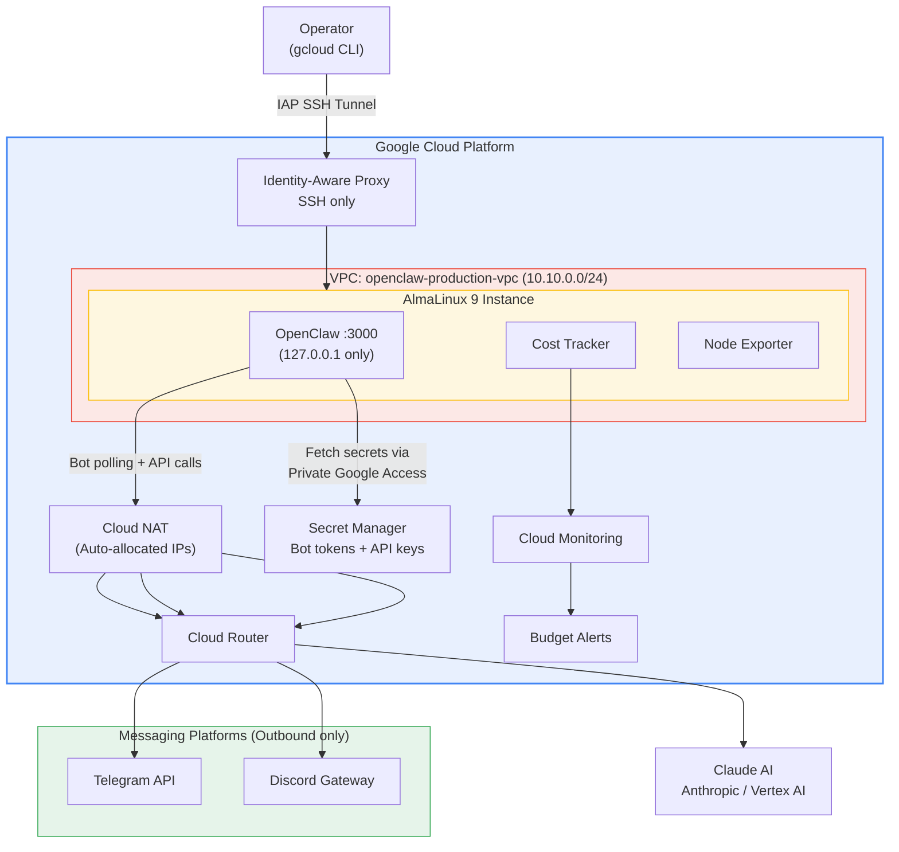
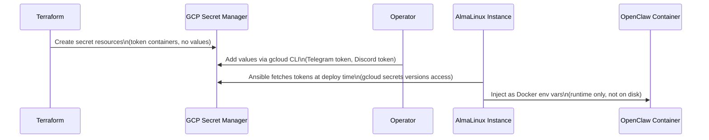
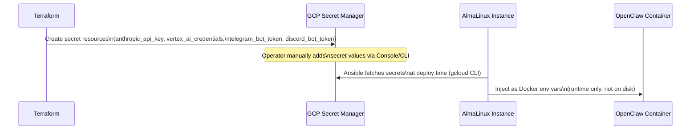
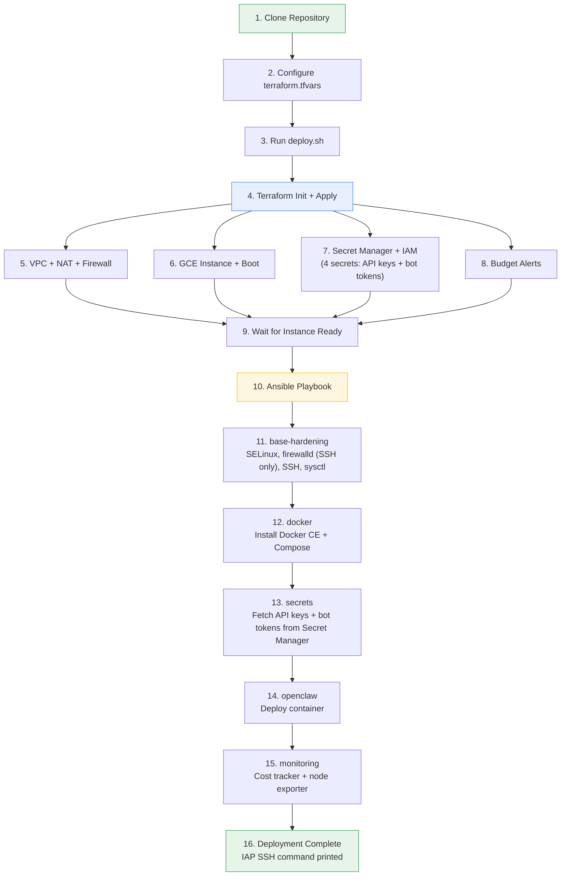

# Architecture

This document describes the full infrastructure architecture for the OpenClaw GCP deployment. Every design decision here comes from running production workloads across enterprise environments in the MENA region -- where compliance requirements, cost sensitivity, and operational simplicity are non-negotiable.

---

## High-Level Overview

OpenClaw is a **bot-first** AI assistant. It does not serve web traffic -- it dials out to Telegram, Discord, and WhatsApp APIs on behalf of users. This means no inbound ports, no load balancer, no domain name, and no SSL certificate management. The VM is completely unreachable from the internet.



---

## Network Architecture

### VPC Design

The deployment uses a custom-mode VPC with a single subnet. Custom mode prevents GCP from auto-creating subnets in every region, which keeps the network clean and auditable.

| Resource | Name | Details |
|----------|------|---------|
| VPC | `openclaw-production-vpc` | Custom mode, no auto-subnets |
| Subnet | `openclaw-production-subnet` | `10.10.0.0/24`, Private Google Access enabled |
| Cloud Router | `openclaw-production-router` | BGP ASN 64514 |
| Cloud NAT | `openclaw-production-nat` | Auto-allocated IPs, all subnets |

**Private Google Access** is enabled on the subnet, which means the instance can reach Google APIs (Secret Manager, Cloud Monitoring) without routing through Cloud NAT. This reduces NAT costs and latency for GCP API calls.

### No Public IP, No Inbound Traffic

The instance has no public IP address and accepts no inbound web connections. This is not a compromise -- it is the correct architecture for a bot-driven application:

| Traffic Direction | Path |
|-------------------|------|
| Inbound (SSH) | Operator --> IAP Tunnel --> Instance port 22 |
| Outbound (bot polling) | Instance --> Cloud NAT --> Telegram / Discord APIs |
| Outbound (Claude API) | Instance --> Cloud NAT --> Anthropic / Vertex AI |
| Outbound (GCP APIs) | Instance --> Private Google Access (no NAT needed) |

There is no inbound user traffic of any kind. Users interact through their Telegram or Discord clients; OpenClaw polls those platforms outbound.

### Firewall Rules

Firewall rules follow a strict default-deny model. With no inbound web traffic to accept, the rule set is minimal:

| Rule | Priority | Source | Ports | Purpose |
|------|----------|--------|-------|---------|
| `allow-iap` | 1000 | `35.235.240.0/20` | TCP 22 | SSH via IAP tunnel |
| `allow-ssh` (optional) | 1000 | User-defined CIDRs | TCP 22 | Direct SSH (disabled by default) |
| `deny-all-ingress` | 65534 | `0.0.0.0/0` | All | Explicit default deny |

VPC flow logs are enabled on the subnet with 50% sampling and 10-minute aggregation for network forensics.

---

## Compute

### Why AlmaLinux 9

I chose AlmaLinux 9 over Ubuntu for several reasons:

1. **SELinux works out of the box** -- Ubuntu uses AppArmor, which lacks the granular mandatory access control needed for container workloads in regulated environments
2. **Red Hat ecosystem** -- Binary-compatible with RHEL 9, which means CIS benchmarks, STIG guides, and enterprise security tooling work without modification
3. **Enterprise stability** -- 10-year support lifecycle, minimal surprise updates
4. **MENA enterprise alignment** -- Most government and enterprise clients in the UAE and Egypt run RHEL or CentOS derivatives

### Instance Configuration

| Setting | Value | Rationale |
|---------|-------|-----------|
| Machine type | `e2-standard-2` | 2 vCPU, 8 GB RAM -- sufficient for OpenClaw + monitoring |
| Boot disk | 30 GB pd-ssd | SSD for fast container startup |
| Shielded VM | Enabled | Secure Boot + vTPM + integrity monitoring |
| Scheduling | Non-preemptible | No unexpected restarts; automatic restart on host events |
| OS Login | Enabled | GCP-managed SSH keys, no per-instance key management |

### Startup Script

The instance bootstrap installs Python 3, pip, git, and Ansible dependencies. The full application stack (Docker, OpenClaw, monitoring) is deployed by Ansible after the instance comes up. This separation keeps infrastructure provisioning (Terraform) and configuration management (Ansible) cleanly decoupled.

---

## Operator Access

### SSH via Identity-Aware Proxy

The only way to reach the instance is through Google's Identity-Aware Proxy:

```bash
gcloud compute ssh openclaw-production-instance \
  --zone us-central1-a \
  --tunnel-through-iap
```

IAP verifies the operator's GCP identity before establishing the TCP tunnel. No SSH port is exposed to the internet. The firewall rule allows TCP 22 only from IAP's source range (`35.235.240.0/20`).

### Browser Access via SSH Port-Forward

To access the OpenClaw web UI during administration:

```bash
gcloud compute ssh openclaw-production-instance \
  --zone us-central1-a \
  --tunnel-through-iap \
  -- -L 3000:localhost:3000
```

Then open `http://localhost:3000` in your browser. The port-forward uses the existing IAP SSH tunnel -- no additional firewall rules or public ports needed. Close the terminal to end the session.

This is intentionally operator-only. Day-to-day user interaction happens through Telegram or Discord.

---

## Messaging Channels

### How OpenClaw Connects to Messaging Platforms

OpenClaw uses **outbound polling** (not inbound webhooks) for messaging channels. This is the key architectural insight that eliminates the need for a domain, SSL certificate, or load balancer:

| Channel | Connection Mode | Domain Required? |
|---------|----------------|------------------|
| Telegram | Long polling (grammY) | No |
| Discord | Gateway API (WebSocket) | No |
| WhatsApp | QR pairing, local state | No |

OpenClaw's process establishes a persistent outbound connection to the platform's API. Messages flow in over that connection. The platform never needs to reach back to the instance.

### Bot Token Secrets Flow



Tokens never appear in:
- Terraform state (Terraform creates the secret *resource*, not the *value*)
- Ansible playbooks or variables
- Docker Compose files committed to version control
- Instance metadata or startup scripts

---

## Secrets Management

### GCP Secret Manager Flow



Secrets managed by this deployment:

| Secret | Purpose | Required |
|--------|---------|----------|
| `openclaw-production-anthropic-api-key` | Anthropic direct API | When `claude_provider = anthropic_api` |
| `openclaw-production-vertex-ai-credentials` | Vertex AI service account key | When `claude_provider = vertex_ai` |
| `openclaw-production-telegram-bot-token` | Telegram bot token | When `openclaw_channels.telegram = true` |
| `openclaw-production-discord-bot-token` | Discord bot token | When `openclaw_channels.discord = true` |

---

## Claude AI Provider Toggle

The deployment supports two Claude AI backends:

| Provider | Variable Value | Requirements |
|----------|---------------|--------------|
| Anthropic API (direct) | `anthropic_api` | API key in Secret Manager |
| Vertex AI | `vertex_ai` | Vertex AI credentials, `aiplatform.user` IAM role |

Switching providers requires changing `claude_provider` in both `terraform.tfvars` and `ansible/group_vars/all.yml`, then rerunning the deployment. Terraform adjusts IAM bindings and secret resources; Ansible configures the correct environment variables for the OpenClaw container.

**When to use which:**
- **Anthropic API** -- Simpler setup, direct billing from Anthropic, global availability
- **Vertex AI** -- GCP-native billing (consolidated invoice), data residency controls, enterprise support agreements

---

## Container Architecture

### Docker Compose Stack

The application runs as a single Docker Compose service:

| Service | Image | Port Binding | Purpose |
|---------|-------|-------------|---------|
| `openclaw` | `openclaw/openclaw:latest` | `127.0.0.1:3000` | AI assistant + bot polling |

The port binding is intentionally `127.0.0.1:3000` (localhost only). The container is not accessible from the network. Access is only via SSH port-forward for administration.

### Docker Security

- **SELinux integration** -- Docker daemon runs with `selinux-enabled: true`, containers get proper SELinux labels
- **No privileged containers** -- All containers run with default capabilities
- **Log rotation** -- JSON file driver with 10 MB max size, 3 files max
- **Overlay2 storage** -- Production-grade storage driver for AlmaLinux

---

## Deployment Flow



---

## Infrastructure as Code Boundaries

| Concern | Managed By | Files |
|---------|-----------|-------|
| Network (VPC, NAT, firewall) | Terraform | `network.tf` |
| Compute (instance, image) | Terraform | `compute.tf` |
| IAM (service account, roles) | Terraform | `iam.tf` |
| Secrets (resource creation) | Terraform | `secrets.tf` |
| Secrets (value injection) | Ansible | `roles/secrets/` |
| OS hardening | Ansible | `roles/base-hardening/` |
| Application deployment | Ansible | `roles/openclaw/` |
| Monitoring agents | Ansible | `roles/monitoring/` |
| Docker installation | Ansible | `roles/docker/` |

This boundary is intentional. Terraform manages infrastructure lifecycle (create, update, destroy). Ansible manages instance configuration and application deployment. Neither crosses into the other's domain.
